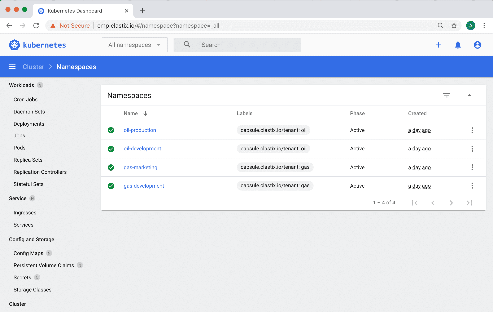

**Success Notice:** Данная статья перевод моей же статьи, которуя я писал для Capsule, чтобы через Kubernetes Dasboard можно было взаимодействовать только с теми namespace, к которым у пользователя есть доступ, с учетом того, что доступ к cluster-scope ресурсам тоже будет, но ограничен.
Оригинал статьи [тут](https://capsule.clastix.io/docs/guides/kubernetes-dashboard/#configuring-kubernetes-dashboard) и [тут](https://github.com/clastix/capsule/blob/master/docs/content/guides/kubernetes-dashboard.md)

### Немного вводных данных

Если вы используется в своем кластере [Capsule](https://capsule.clastix.io) для реализации подхода Namespace As A Service (NAAS), тогда было бы неплохим решением - предоставить командам, работающим в кластере, UI, в котором можно будет увидеть только тот контент, к которым у них есть доступ, учитывая cluster-scope (например namespace, clusterrole,clusterrolebinding и т.д.). 

По умолчанию RBAC Kubernetes не позволяет ограничивать составляющие ресурса, на который предоставлен доступ (например, get, list). Если в clusterrole указано:
```yaml
rules:
- apiGroups:
  - ""
  resources:
  - namespace
  verbs:
  - get
  - list
  - watch
```
Это означает, что пользователь, связанный с данной ролью, будет иметь доступ ко всем namespace в кластере: системным, namespace других команд и своим. Однако, это не рекомендуется с точки зрения юзабилити и безопасности.

Если выполнить запрос на получение namespace через Capsule Proxy вместо прямого обращения к Kubernetes API, мы сможем получить доступ к ресурсам cluster-scope, но при этом ограничить область видимости.

```bash
$ kubectl get namespaces
NAME                STATUS   AGE
gas-marketing       Active   2m
oil-development     Active   2m
oil-production      Active   2m
```

**Success Notice:** Capsule Proxy определяет доступ пользователя к namespace на основе Tenant'ов - это кастомный ресурс, с помощью которого Capsule реализует разграничение кластера Kubernetes на "зоны" для работы команд или проектов

Если авторизация пользователей в кластере осуществляется через технологию OIDC (например, KeyCloak), то можно настроить Kubernetes Dashboard с авторизацией через KeyCloak и управлять зонами видимости с помощью Capsule Proxy.



### Настройка oauth2-proxy

Чтобы включить oauth2 авторизацию в Kubernetes Dashboard, нам нужно использовать прокси-сервер OAuth. В этой статье мы будем использовать [oauth2-proxy](https://oauth2-proxy.github.io/oauth2-proxy/) и установим его как pod’а в namespace, где развернут Dashboard. В качестве альтернативы мы можем установить oauth2-proxy в другом тфьуызфсу или использовать его в качестве sidecar container в deployment Kubernetes Dashboard.

Подготовливаем values для oauth2-proxy:
```bash
cat > values-oauth2-proxy.yaml <<EOF
config:
  clientID: "${OIDC_CLIENT_ID}"
  clientSecret: ${OIDC_CLIENT_SECRET}

extraArgs:
  provider: "keycloak-oidc"
  redirect-url: "https://${DASHBOARD_URL}/oauth2/callback"
  oidc-issuer-url: "https://${KEYCLOAK_URL}/auth/realms/${OIDC_CLIENT_ID}"
  pass-access-token: true
  set-authorization-header: true
  pass-user-headers: true

ingress:
  enabled: true
  path: "/oauth2"
  hosts:
    - ${DASHBOARD_URL}
  tls:
    - hosts:
      - ${DASHBOARD_URL}
EOF
```
Где:
> **OIDC_CLIENT_ID**: ID (или же имя) клиента в KeyCloak, который Kubernetes API использует для аутентификации пользователей
> **OIDC_CLIENT_SECRET**: сикрет для клиента. Вы можете посмотреть его в Keycloack UI -> Clients -> OIDC_CLIENT_ID -> Credentials
> **DASHBOARD_URL**: адрес Kubernetes Dashboard
> **KEYCLOAK_URL**: адресс KeyCloak
Больше информации о настройке KeyCloak-oidc провайдера можно посмтреть в документации oauth2-proxy

Устанавливаем aouth2-proxy:
```bash
helm repo add oauth2-proxy https://oauth2-proxy.github.io/manifests
helm install oauth2-proxy oauth2-proxy/oauth2-proxy -n ${KUBERNETES_DASHBOARD_NAMESPACE} -f values-oauth2-proxy.yaml
```

### Настройка KeyCloak

Если у вас уже настроена авторизация пользователей в кластере Kubernetes через KeyCloak, тогда в манифесте kube-apiserver.yaml должны быть следующие строки:
```yaml
spec:
  containers:
  - command:
    - kube-apiserver
    ...
    - --oidc-issuer-url=https://${OIDC_ISSUER}
    - --oidc-ca-file=/etc/kubernetes/oidc/ca.crt
    - --oidc-client-id=${OIDC_CLIENT_ID}
    - --oidc-username-claim=preferred_username
    - --oidc-groups-claim=groups
    - --oidc-username-prefix=-
```

Где **${OIDC_CLIENT_ID}** - это ID (или имя) клиента, через которого идет аутентификация пользователей. Для этого пользователя необходимо сделать несколько настроек:

1. Убедиться, что в параметре Valid Redirect URIs разрешен настроиваемый домен для редиректра https://${DASHBOARD_URL}/oauth2/callback
2. Создать mapper, у которого **Mapper Type** - Group Membership, а **Token Claim Name** - group
3. Создать mapper, у которого **Mapper Type** - Audience, а в **Included Client Audience** - указан наш ${OIDC_CLIENT_ID}

### Настройка Kubernetes Dashboard

Если Capsule Proxy работает по протоколу HTTPS и использует не Kubernetes CA сертификат, тогда нам необходимо добавить нужные сертификат в Kubernetes Dashboard.
Для этого создает secter с сертификатом:
```bash
cat > ca.crt<< EOF
-----BEGIN CERTIFICATE-----
...
...
...
-----END CERTIFICATE-----
EOF

kubectl create secret generic certificate --from-file=ca.crt=ca.crt -n ${KUBERNETES_DASHBOARD_NAMESPACE}
```

Подготовливаем values для Kubernetes Dashboard:
```bash
cat > values-kubernetes-dashboard.yaml <<EOF
extraVolumes:
  - name: token-ca
    projected:
      sources:
        - serviceAccountToken:
            expirationSeconds: 86400
            path: token
        - secret:
            name: certificate
            items:
              - key: ca.crt
                path: ca.crt
extraVolumeMounts:
  - mountPath: /var/run/secrets/kubernetes.io/serviceaccount/
    name: token-ca

ingress:
  enabled: true
  annotations:
    nginx.ingress.kubernetes.io/auth-signin: https://${DASHBOARD_URL}/oauth2/start?rd=$escaped_request_uri
    nginx.ingress.kubernetes.io/auth-url: https://${DASHBOARD_URL}/oauth2/auth
  hosts:
    - ${DASHBOARD_URL}
  tls:
    - hosts:
      - ${DASHBOARD_URL}

extraEnv:
  - name: KUBERNETES_SERVICE_HOST
    value: '${CAPSULE_PROXY_URL}'
  - name: KUBERNETES_SERVICE_PORT
    value: '${CAPSULE_PROXY_PORT}'
EOF
```
Чтобы добавить CA сертифкат для URL Capsule Proxy, мы используем volume tokec-ca для монтирования файла ca.crt. 

Кроме того, мы устанавливаем переменные среды **KUBERNETES_SERVICE_HOST** и **KUBERNETES_SERVICE_PORT** для маршрутизации запросов к Capsule Proxy, вместо Kubernetes API.

Устанавливаем Kubernetes Dashboard:
```bash
helm repo add kubernetes-dashboard https://kubernetes.github.io/dashboard/
helm install kubernetes-dashboard kubernetes-dashboard/kubernetes-dashboard -n ${KUBERNETES_DASHBOARD_NAMESPACE} -f values-kubernetes-dashboard.yaml
```

---
На этом настройка завершена. Вы великолепны ;)